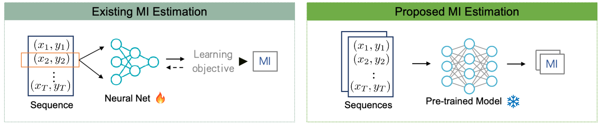
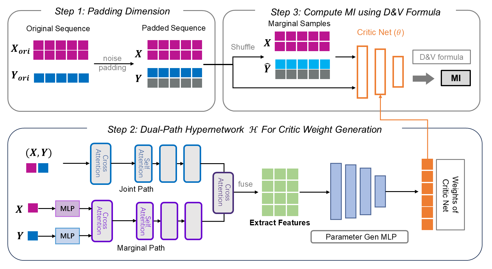

<p align="center">
  
</p>

<h1 align="center">InfoAtlas</h1>

<p align="center">
  <b>A Foundation Model for Zero-Shot Statistical Dependence Estimate</b>
</p>

<p align="center">
  <a href="https://datou30.github.io/InfoAtlas-page/">Project Page</a> &nbsp;&bull;&nbsp;
  <a href="https://arxiv.org/abs/2606.00241">Paper</a> &nbsp;&bull;&nbsp;
  <a href="#-pretrained-checkpoints">Checkpoints</a> &nbsp;&bull;&nbsp;
  <a href="#-quick-start">Quick Start</a> &nbsp;&bull;&nbsp;
  <a href="#-estimate-mi">Estimate MI</a> &nbsp;&bull;&nbsp;
  <a href="#-reproducing-experiments">Experiments</a> &nbsp;&bull;&nbsp;
  <a href="#-citation">Citation</a>
</p>

<p align="center">
  
  
  
</p>

---

**InfoAtlas is for when you need accurate dependency estimates over large amounts of data, fast.**
Classical neural mutual-information (MI) estimators retrain a network from scratch for *every* new
dataset. InfoAtlas is *pretrained*: it reads a batch of paired samples and returns the mutual
information in a **single forward pass** — no per-dataset optimization, fully differentiable, and
batched so you can score thousands of variable pairs at once. A single model handles arbitrary
sample sizes and dimension `d` (large `d` is handled via k-sliced MI).

> 🎉 **InfoAtlas has been accepted at ICML 2026.**

---

## ✨ Highlights

- **Zero-shot.** One pretrained model, no gradient steps at inference.
- **Fast.** Tens of milliseconds to score a batch of pairs (see [benchmark](#-speed--memory)).
- **Flexible.** Any sample size `N`, and dimension `d` (large `d` requires k-sliced MI).
- **Differentiable.** Drop it into a larger pipeline as a dependency loss / regularizer.
- **Vectorized.** Estimate many pairs / many projections in a single batched call.

---

## 🚀 Installation

**Requirements:** Python ≥ 3.9, PyTorch ≥ 2.0, CUDA strongly recommended.

```bash
pip install -r requirements.txt
```

Core dependencies: `torch`, `lightning`, `hydra-core`, `omegaconf`, `torchsort`, `einops`,
`scipy`, `scikit-learn`. `torchsort` builds a small CUDA/C++ extension — make sure your CUDA
toolkit matches your PyTorch build.

---

## 📦 Pretrained Checkpoints

We release checkpoints for several maximum input dimensions (optimizer state stripped for a small
download). All are loaded the same way; the config is embedded in each file, so no separate YAML is
required.

| Checkpoint | Max dim | Steps | Notes |
|:-----------|:-------:|:-----:|:------|
| `infoatlas_maxdim3_step175000.ckpt` | 3 | 175,000 | Most accurate on low-dimensional inputs (`d ≤ 3`), including strong / high-MI dependence. |
| `infoatlas_maxdim5_step432500.ckpt` | 5 | 432,500 | Robust general-purpose model — recommended default for `d ≤ 5`. |
| `infoatlas_maxdim10_step097500.ckpt` | 10 | 97,500 | Handles inputs up to `d = 10` natively. |

**Choosing a checkpoint.** Pick the smallest `max_dim` that is ≥ your data dimension: the `max_dim = 3`
model is the most accurate on `d ≤ 3` inputs, `max_dim = 5` is the general-purpose default, and
`max_dim = 10` covers up to 10-dimensional inputs. For higher dimensions, use k-sliced MI
(`compute_ksmi_mean`) with any checkpoint. The `max_dim = 3` and `max_dim = 10` models apply an extra
whitening step, which is stored in the checkpoint and handled automatically (see
[Preprocessing](#-preprocessing-must-match-training)).

**Download (Google Drive):** [InfoAtlas checkpoints](https://drive.google.com/open?id=1Syjm-Rprnx_dYYOHLEL1dZxHplcLKUsM)

```python
from infer import load_ckpt
_, model, cfg, device = load_ckpt("infoatlas_maxdim5_step432500.ckpt")  # cfg is read from the ckpt
```

---

## ⚡ Quick Start

Estimate mutual information between two variables in a few lines:

```python
import numpy as np
from infer import load_ckpt, estimate_mi

_, model, cfg, device = load_ckpt("infoatlas_maxdim5_step432500.ckpt")

# X, Y: [N, d] arrays (numpy or torch), N samples, d <= 5 dimensions
X = np.random.randn(2000, 3)
Y = 0.8 * X + 0.6 * np.random.randn(2000, 3)

mi = estimate_mi(X, Y, model=model, max_dim=cfg.input_dim_x, softrank_reg=cfg.softrank_reg)
print(f"Estimated MI: {mi:.4f} nats")
```

**Recommendation: prefer the batched / GPU calls.** InfoAtlas is fastest when you hand it many
pairs at once (`estimate_mi_batch`) and keep everything on GPU (`*_gpu` variants) instead of
looping over single pairs.

---

## ⏱ Speed & Memory

Single NVIDIA H200, processing a batch of `16` pairs (`batchsize = 16`). The table reports the
**per-pair** cost, i.e. the batch's total time and peak memory divided by 16 — so running the full
16-pair batch costs roughly **16×** the values below.

| Sample size `N` | 1 k | 5 k | 10 k | 20 k | 50 k |
|:----------------|:---:|:---:|:----:|:----:|:----:|
| Time per pair (s) | 0.039 | 0.049 | 0.055 | 0.070 | 0.106 |
| GPU memory per pair (GB) | 0.21 | 0.55 | 0.98 | 1.81 | 4.33 |

Batching amortizes cost across pairs, so large-`N`, many-pair workloads stay cheap.

---

## 🧠 Estimate MI

`infer.py` exposes the estimation entry points. Every function accepts `numpy.ndarray` or
`torch.Tensor`, and each has a GPU-resident `*_gpu` counterpart (`estimate_mi_gpu`,
`estimate_mi_batch_gpu`, `compute_ksmi_mean_gpu`) that avoids the CPU round-trip — prefer these for
throughput.

| Function | `X` shape | `Y` shape | Returns | Use it for |
|:---------|:----------|:----------|:--------|:-----------|
| `estimate_mi` | `[N, d]` | `[N, d]` | `float` | A single pair |
| `estimate_mi_batch` | `[B, N, d]` | `[B, N, d]` | `Tensor [B]` | Many pairs in one pass |
| `compute_ksmi_mean` | `[N, dx]` | `[N, dy]` | `float` | Large `d` via k-sliced MI |

```python
# Load once
module, model, cfg, device = load_ckpt("infoatlas_maxdim5_step432500.ckpt", device="cuda")
```

### Batch of pairs (recommended)

```python
from infer import estimate_mi_batch
# X, Y: [B, N, d]
mi = estimate_mi_batch(X, Y, model=model, max_dim=cfg.input_dim_x, softrank_reg=cfg.softrank_reg)
# -> Tensor of shape [B]
```

### Large dimension — k-sliced MI

For variables whose dimension exceeds `max_dim` (e.g. 128-D / 512-D embeddings), project to a low
dimension with random slices and average. InfoAtlas is particularly strong here:
**large-`d` tasks paired with 5-dimensional sliced MI (5-SMI) work very well.**

```python
from infer import compute_ksmi_mean
mi = compute_ksmi_mean(
    X, Y,                       # [N, dx], [N, dy] with dx, dy arbitrarily large
    projection_dim=5,           # slice down to <= max_dim (5 here; use <= 3 for the max_dim=3 model)
    model=model, proj_num=64, batchsize=32,
    max_dim=cfg.input_dim_x, softrank_reg=cfg.softrank_reg,
    normalize_input=True,
)
```

> **Input rules.** For `estimate_mi` / `estimate_mi_batch`, `d` must be `≤ max_dim` (3, 5, or 10
> depending on the checkpoint — read it from `cfg.input_dim_x`). For larger `d`, use
> `compute_ksmi_mean`. MI is returned in nats.

---

## 📊 Reproducing Experiments

Evaluation scripts live in `evaluations/` and share a common CLI:

```bash
python -m evaluations.<script> --ckpt_path <CKPT> [options]
```

The checkpoint carries its own config, so `--cfg_path` is optional.

**Synthetic MI — continuous (Beta / Gamma / Bernoulli / Poisson):**
```bash
python -m evaluations.evaluate_sync --ckpt_path infoatlas_maxdim5_step432500.ckpt --output_dir results/sync
```

**Synthetic MI — discrete (categorical):**
```bash
python -m evaluations.evaluate_sync_discrete --ckpt_path infoatlas_maxdim5_step432500.ckpt --output_dir results/sync_discrete
```

**Independence testing (ROC-AUC):**
```bash
python -m evaluations.evaluate_independence --ckpt_path infoatlas_maxdim5_step432500.ckpt \
    --test_methods test2 --dims 128 --num_test 30 --proj_num 64
```
`--test_methods` accepts `test1` (sum projection), `test2` (partial projection), `test3` (additive noise).

**CLIP sliced MI:**
```bash
python -m evaluations.evaluate_clip --ckpt_path infoatlas_maxdim5_step432500.ckpt \
    --data_path path/to/embeddings.npz --sample_num 5000 --proj_num 25 --num_repeats 20
```
The `.npz` should contain `image_embeddings` and `text_embeddings`.

**Point tracking (trajectory dependence):**
```bash
python -m evaluations.evaluate_2dtrack --ckpt_path infoatlas_maxdim5_step432500.ckpt \
    --data_root path/to/point_odyssey/val --video_configs "ani_s:2000,2100" --output_dir results/track
```
Measures dependence between motion trajectories; the same pipeline applies to 3-D tracks. The
[PointOdyssey](https://pointodyssey.com/) data is **not bundled** — download it from the official
source (or substitute your own trajectories) and point `--data_root` at it.

**BMI benchmark** (`evaluate_bmi.py`) additionally requires the [`bmi`](https://github.com/cbg-ethz/bmi)
package, which synthesizes its tasks on the fly:
```bash
python -m evaluations.evaluate_bmi --ckpt_path infoatlas_maxdim5_step432500.ckpt --sample_size 100 --repeats 10
```

> Run `python -m evaluations.<script> --help` for the full flag list of each script. Some scripts
> expect data files (embeddings, trajectories) that you provide or generate yourself.

---

## 🧩 How It Works

<p align="center">
  
</p>

Paired samples are mapped through a **soft-rank Gaussian-copula** transform (`preprocessing.py`),
followed by an **optional per-side whitening** step, and then encoded by a **Perceiver-style**
cross/self-attention encoder; a **hypernetwork** generates the weights of a critic network whose
output the decoder turns into an MI estimate — all in one forward pass. The result is a single
pretrained model that estimates dependence zero-shot.

## 🔧 Preprocessing must match training

InfoAtlas is trained on inputs that pass through a fixed preprocessing pipeline, and it expects the
**same** pipeline at inference — matching it matters for accuracy. Two things line up with the
checkpoint you load:

- **Soft-rank strength.** Use the same soft-rank regularization the model was trained with. It is
  stored in the checkpoint as `cfg.softrank_reg`; passing `softrank_reg=cfg.softrank_reg` (as in the
  examples above) keeps you matched.
- **Whitening.** Some checkpoints apply an extra per-side whitening step (on for `max_dim = 3` and
  `max_dim = 10`, off for `max_dim = 5`). This setting is stored in the checkpoint too, and the
  estimation functions apply it automatically after `load_ckpt` — you do not need to do anything.

In short: load with `load_ckpt`, then pass `max_dim=cfg.input_dim_x` and
`softrank_reg=cfg.softrank_reg`, and the preprocessing will match what the model saw during training.
Using different preprocessing (e.g. a mismatched soft-rank strength) can noticeably bias the estimate.

---

## 📁 Project Structure

```
InfoAtlas/
├── infer.py              # Estimation API: load_ckpt, estimate_mi[_batch], compute_ksmi_mean (+ _gpu)
├── preprocessing.py      # Soft-rank copula transform + noise padding + optional per-side whitening
├── evaluation.py         # Validation utilities (independence testing, sliced MI)
├── clean_ckpt.py         # Strip optimizer state + reduce embedded config for release
├── train.py              # Model definition + training loop (Lightning + Hydra)
├── config/               # Hydra configs (default_5d.yaml, ...)
├── infonet/              # Model: encoder / decoder / query generator / hypernetwork
├── evaluations/          # Standalone evaluation scripts (sync, independence, clip, track, bmi)
├── baselines/            # Third-party MI estimators for comparison (see NOTICE)
└── requirements.txt
```

---

## 📝 Citation

InfoAtlas is accepted at **ICML 2026**. If you find it useful, please cite:

```bibtex
@article{hu2026infoatlas,
  title   = {InfoAtlas: A Foundation Model for Zero-Shot Statistical Dependence Estimate},
  author  = {Hu, Zhengyang and Chen, Yanzhi and Ren, Hanxiang and Zeng, Qunsong and
             Zheng, Youyi and Weller, Adrian and Huang, Kaibin and Yang, Yanchao},
  journal = {arXiv preprint arXiv:2606.00241},
  year    = {2026},
}
```

Paper: [arXiv:2606.00241](https://arxiv.org/abs/2606.00241)

---

## 🙏 Acknowledgements

`baselines/` contains third-party MI estimators (e.g. MINE, InfoNCE, SMILE, KSG, MINDE) included
for comparison; they remain under their original licenses and are credited to their respective
authors. See `baselines/NOTICE.md` for details.
